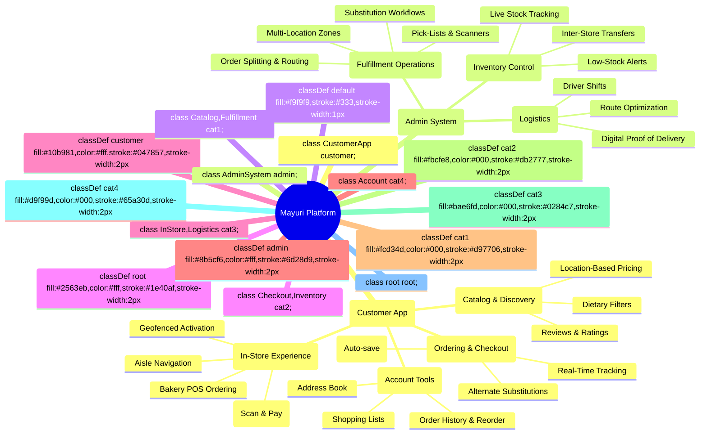

# Mayuri Grocery Stores Platform - Executive Summary

```mermaid
mindmap
  root((Mayuri Platform))
    CustomerApp("Customer App")
      Catalog("Catalog & Discovery")
        Location-Based Pricing
        Dietary Filters  
        Reviews & Ratings
      Checkout("Ordering & Checkout")
        Smart Cart (Auto-save)
        Alternate Substitutions
        Real-Time Tracking
      InStore("In-Store Experience")
        Geofenced Activation
        Aisle Navigation
        Self-Checkout (Scan & Pay)
        Bakery POS Ordering
      Account("Account Tools")
        Address Book
        Order History & Reorder
        Shopping Lists
    AdminSystem("Admin System")
      Fulfillment("Fulfillment Operations")
        Multi-Location Zones
        Order Splitting & Routing
        Pick-Lists & Scanners
        Substitution Workflows
      Inventory("Inventory Control")
        Live Stock Tracking
        Low-Stock Alerts
        Inter-Store Transfers
      Logistics("Logistics")
        Driver Shifts
        Route Optimization
        Digital Proof of Delivery

    classDef default fill:#f9f9f9,stroke:#333,stroke-width:1px;
    classDef root fill:#2563eb,color:#fff,stroke:#1e40af,stroke-width:2px;
    classDef customer fill:#10b981,color:#fff,stroke:#047857,stroke-width:2px;
    classDef admin fill:#8b5cf6,color:#fff,stroke:#6d28d9,stroke-width:2px;
    classDef cat1 fill:#fcd34d,color:#000,stroke:#d97706,stroke-width:2px;
    classDef cat2 fill:#fbcfe8,color:#000,stroke:#db2777,stroke-width:2px;
    classDef cat3 fill:#bae6fd,color:#000,stroke:#0284c7,stroke-width:2px;
    classDef cat4 fill:#d9f99d,color:#000,stroke:#65a30d,stroke-width:2px;
    
    class root root;
    class CustomerApp customer;
    class AdminSystem admin;
    class Catalog,Fulfillment cat1;
    class Checkout,Inventory cat2;
    class InStore,Logistics cat3;
    class Account cat4;
```
