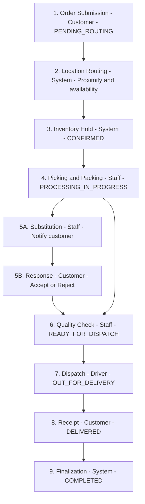

# Software Requirements Specification (SRS)
## Project: Mayuri Grocery Stores Application

This document details the functional and non-functional requirements for the Mayuri Grocery Stores web and mobile application, incorporating multi-location support, the specified tech stack, and the detailed order fulfillment flow with substitution logic.

---

## 1. Introduction

### 1.1 Purpose
This document details the functional and non-functional requirements for the Mayuri Grocery Stores web and mobile application. Its primary goal is to serve as the foundation for the development of a scalable, multi-location e-commerce platform for grocery operations.

### 1.2 Scope of the Product
The project encompasses two distinct applications:
* **Admin/Store Application (PWA & Mobile):** Used by internal staff for order processing, inventory management, store/warehouse configuration, and reporting.
* **Customer Application (Web & Mobile/Tablet):** Used by end customers for browsing products, placing orders, making payments, and tracking deliveries.

### 1.3 Business Goals & Vision
* Increase sales and market reach through a robust digital presence.
* Improve customer loyalty and convenience with a seamless ordering experience.
* Streamline internal operations, inventory, and order fulfillment across multiple locations.

---

## 2. Overall Description

### 2.1 Product Functions (High-Level Summary)
* **Customer Experience:** Account management, location-based product catalog display, advanced search, and shopping cart.
* **Multi-Location Management:** Manage inventory and staff across multiple physical stores and centralized warehouses.
* **Order Routing:** Automatically assign orders to the optimal store/warehouse based on customer delivery address and current stock.
* **Fulfillment:** Detailed picking/packing process with both customer-initiated and store-initiated product substitution workflows.

### 2.2 User Classes and Product Deployment

| User Class | Primary Roles | Access Platform | Technology |
| :--- | :--- | :--- | :--- |
| **Customer** | Browses, orders, pays, tracks delivery. | Web, Mobile (iOS/Android), Tablet | Web: React JS / Mobile: Flutter |
| **Store Manager** | System configuration, reporting, staff control. | Admin PWA (Web), Admin Mobile | Web: React JS (PWA) / Mobile: Flutter |
| **Picker/Packer** | Fulfills orders, manages stock updates. | Admin Mobile App, Admin PWA | Flutter or React JS (PWA) |
| **Delivery Driver** | Manages delivery routes and confirms hand-offs. | Admin Mobile App | Flutter |

### 2.3 Operating Environment (Tech Stack)
* **Backend (API/Services):** .NET 10.
* **Database:** PostgreSQL or SQL Server (To be finalized).
* **Mobile/Tablet Framework:** **Flutter** (for cross-platform compatibility and future expansion to Google TV/Apple TV).
* **Web Framework:** **React JS** (Customer Web and Admin PWA).

---

## 3. Functional Requirements

### 3.1 Customer Mobile & Web Application
* **User Accounts:** Registration, profile management, and saved addresses.
* **Location-Based Catalog:** Product availability and pricing update dynamically based on the assigned store/warehouse.
* **Substitution Management (Checkout):** Customers can view out-of-stock items at checkout and select alternates before finalizing payment.
* **Order Tracking:** Real-time status updates and notifications for Store-Initiated Substitution Requests.

### 3.2 Store/Admin Web & Mobile Application
* **Store & Warehouse Management:** Define service areas (ZIP codes) and assign staff to specific locations.
* **Inventory Management:** View stock per location, low-stock alerts, and stock transfers.
* **Picking Interface:**
    * Interface for staff to scan products.
    * Ability to flag items as unavailable/damaged to trigger substitution requests.
    * Automatic recalculation of totals upon customer response.

---

## 4. Non-Functional Requirements

| Category | Requirement |
| :--- | :--- |
| **Performance** | Application load time < 3s; Core actions response < 1s. |
| **Scalability** | Designed for 50% growth in inventory and users within Year 1. |
| **Security** | SSL/TLS encryption; PCI-DSS compliance; Role-Based Access Control (RBAC). |
| **Usability** | Intuitive mobile UI with minimal taps for core actions. |

---

## 5. Data Model (High-Level Entities)

| Entity | Description | Key Attributes |
| :--- | :--- | :--- |
| **Customer** | End-user account details. | customer_id, name, email, address |
| **Store** | Physical retail location. | store_id, address, geo_coordinates, service_area |
| **Product** | Base product information. | product_id, SKU, name, description |
| **Inventory** | Tracks stock per location. | product_id (FK), location_id (FK), current_stock |
| **Order** | Customer purchase transaction. | order_id, customer_id (FK), status, total_amount |

---

## 6. Order Fulfillment Flow

> **Preview tip:** If the diagram does not appear, install the **Markdown Preview Mermaid Support** extension in Cursor/VS Code, or view this file on GitHub/GitLab.

---

## 7. Extended Features

The following features extend the core functional and non-functional requirements to enhance customer experience, operations, and platform scalability.

### 7.1 Customer Experience
* **Wishlists / "Buy Again":** Saved lists and one-tap reorder from past orders to reduce friction for repeat purchases.
* **Scheduled / Recurring Orders:** Customers can set weekly or bi-weekly delivery slots (e.g. "every Saturday 10–12") to support loyalty and predictable demand.
* **Delivery Time Slots:** Customers choose a delivery time window; availability is shown per store when routing.
* **Ratings & Reviews:** Per product (and optionally per store) to build trust and guide substitutions.
* **Loyalty / Rewards:** Points or credits per order, redeemable on future orders, to support the customer loyalty goal.

### 7.2 Substitution & Catalog
* **Suggested Substitutes at Checkout:** When an item is low or out of stock, show 1–2 suggested alternates (same category, brand, or size) so the customer can pre-approve before staff picks.
* **"No Substitute" Option:** Customers can mark items as "remove if unavailable" to avoid unwanted replacements.
* **Dietary & Allergen Filters:** Filters (e.g. vegetarian, nut-free) so substitutes and search results stay relevant.

### 7.3 Admin / Operations
* **Batch Picking:** Group orders by aisle/zone and show pick path to reduce picker travel and time.
* **Barcode / QR on Pick List:** Scan to confirm item and quantity; reduce mis-picks and speed training.
* **Driver App: ETA & Proof of Delivery:** Share live ETA with customer; capture signature or photo on delivery for step 8 and audit.
* **Shift & Task Assignment:** Assign pickers and drivers to shifts and orders (by store/zone) for staff control and multi-location operations.

### 7.4 Platform & Scalability
* **Offline-Capable PWA for Pickers:** Cache order and product data so picking continues during patchy warehouse connectivity; sync when back online.
* **Caching & CDN:** Cache catalog and store metadata (e.g. by location) to support <3s load and <1s core actions.
* **Audit Log:** Record who changed inventory, order status, or substitutions and when, for operations and compliance (e.g. PCI).
* **Feature Flags:** Roll out substitution logic, new routing rules, or UI changes per store or segment without full redeploys.